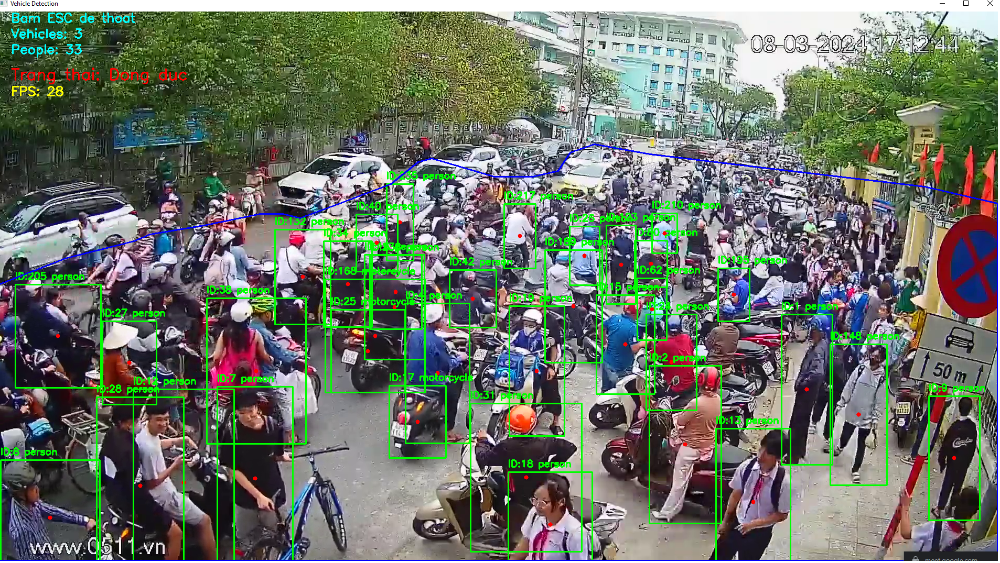
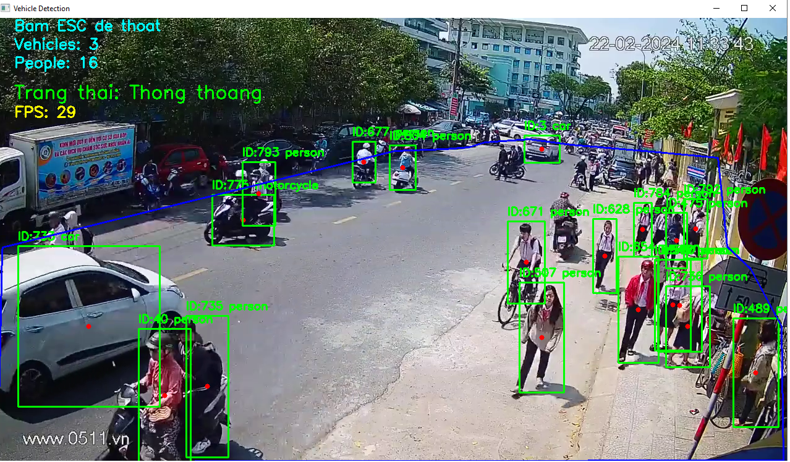
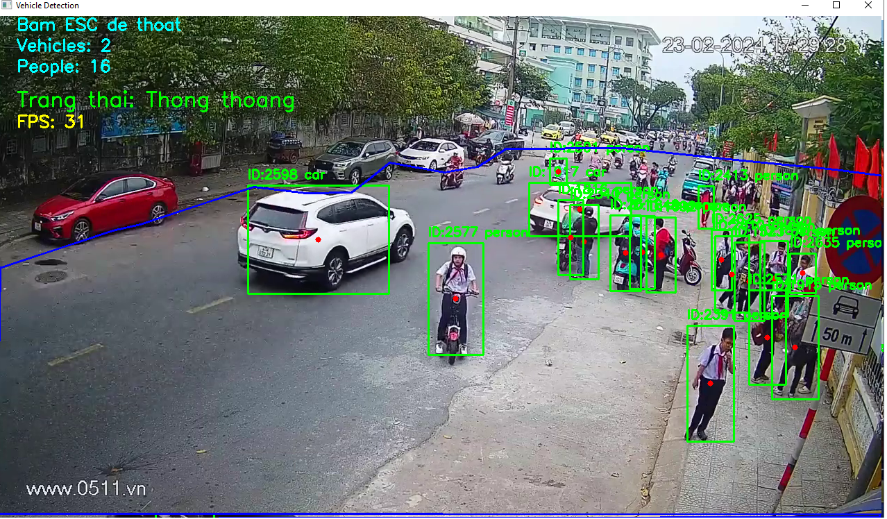
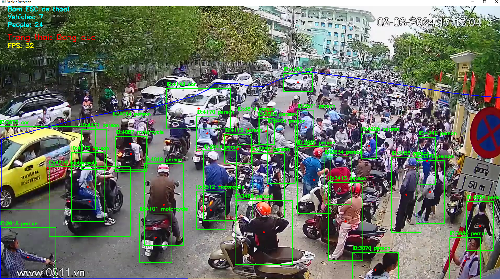

# Vehicle Detection CV
Hệ thống phát hiện và giám sát phương tiện/người trong vùng quan sát (ROI) sử dụng YOLO và ByteTrack, hỗ trợ cả PyTorch (.pt) và TensorRT (.engine).

---

## Tính năng
- Phát hiện và tracking phương tiện (car, motorcycle, bus, truck) và người (person) trong vùng ROI tự định nghĩa
- Hỗ trợ vẽ, lưu và tải lại vùng quan sát (ROI) dưới dạng file JSON
- Hiển thị trạng thái giao thông: **Thông thoáng** / **Đông đúc**
- Hỗ trợ chạy model PyTorch (.pt) và TensorRT (.engine)
- Giao diện đồ họa (GUI) bằng Tkinter

---
## Demo






## Yêu cầu hệ thống
- Python 3.10+
- CUDA 12.4
- GPU NVIDIA (khuyến nghị 6GB VRAM trở lên)
- TensorRT 10.x (nếu dùng .engine)

---

## Cài đặt

```bash
pip install ultralytics opencv-python numpy
```

Nếu dùng TensorRT:
```bash
pip install tensorrt==10.6.0
```

---

## Cấu trúc thư mục

```
project/
├── main.py
├── models/
│   ├── yolo26l.pt          # Model PyTorch gốc
│   └── yolo26l.engine      # Model TensorRT (sau khi export)
├── layouts/
│   └── <video_name>.json   # File lưu vùng ROI theo từng video
└── README.md
```

---

## Hướng dẫn sử dụng

### 1. Chạy ứng dụng
```bash
python main.py
```

### 2. Chọn Model
Bấm **"Chọn Model YOLO"** và chọn file `.pt` hoặc `.engine`.

### 3. Chọn Video
Bấm **"Chọn Video"** và chọn file video. Nếu đã có file layout JSON trùng tên video trong thư mục `layouts/`, hệ thống sẽ tự động tải.

### 4. Vẽ vùng quan sát (ROI)
Bấm **"Vẽ Vùng Quan Sát"**:
- **Click trái**: thêm điểm
- **Click phải**: xóa toàn bộ điểm
- **Ctrl+Z**: xóa điểm vừa vẽ
- **Enter**: xác nhận (cần ít nhất 3 điểm)
- **ESC**: hủy

### 5. Bắt đầu nhận diện
Bấm **"Bắt đầu Detect"**. Nhấn **ESC** trong cửa sổ video để dừng.

---

## Export model YOLO26L sang TensorRT

Export **chạy một lần duy nhất**, tạo ra file `.engine` tối ưu riêng cho GPU của máy.

```python
from ultralytics import YOLO

model = YOLO("models/yolo26l.pt")
model.export(
    format="engine",
    half=True,      # FP16 - tăng tốc ~2x, accuracy gần như không đổi
    device=0,       # GPU index
    workspace=4     # GB VRAM dành cho TensorRT (khuyến nghị để 4 nếu GPU 6GB)
)
# Tạo ra file models/yolo26l.engine
```

> **Lưu ý**: File `.engine` được tối ưu riêng cho GPU của máy export. Không dùng được trên máy khác — phải export lại nếu đổi máy hoặc đổi GPU.

### Yêu cầu để export thành công
| Thành phần | Version |
|---|---|
| CUDA Toolkit | 12.4 |
| TensorRT | 10.6.0 |
| PyTorch (CUDA) | cu124 |

### Kiểm tra môi trường trước khi export
```python
import tensorrt as trt
logger = trt.Logger(trt.Logger.WARNING)
builder = trt.Builder(logger)
print("TensorRT OK:", trt.__version__)
```

---

## So sánh hiệu năng (GTX 1660 Super)

| Cấu hình | FPS thực tế |
|---|---|
| YOLO26L .pt (FP32) | ~12-15 |
| YOLO26L .engine (FP16 TensorRT) | ~17-18 |
| YOLO26L .engine + skip frame | ~25-30 (khớp tốc độ video gốc) |

---

## Ngưỡng cảnh báo
Có thể chỉnh trực tiếp trong `detect_video()` trong `main.py`:

```python
congestion_threshold = 10   # Số phương tiện tối đa trong ROI
crowd_threshold = 20        # Số người tối đa trong ROI
```

Vượt ngưỡng → hiển thị **"Đông đúc"** màu đỏ.
## Authors
GitHub: [thainv299](https://github.com/thainv299)